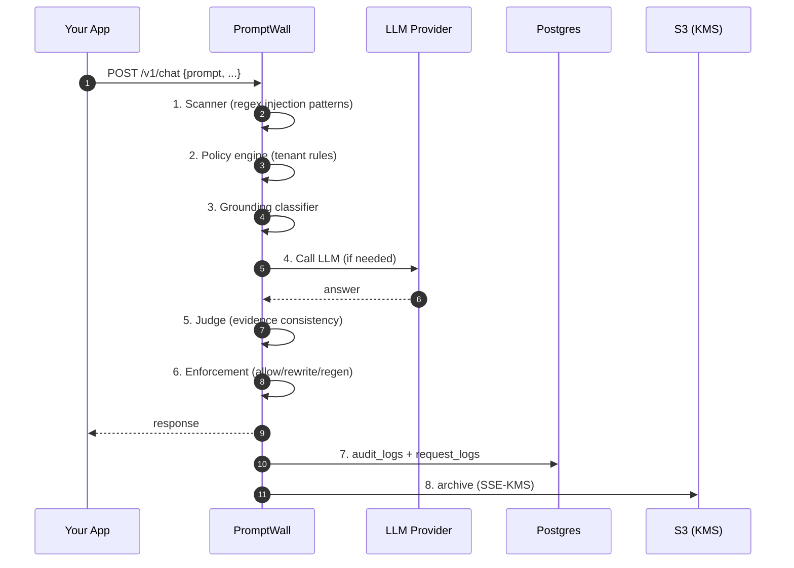

Every request to `/v1/verify` or `/v1/chat` passes through a deterministic
control pipeline. Each stage can allow, rewrite, or block the request, and
the decision is logged for audit.

## The pipeline

## Eight stages

<AccordionGroup>

<Accordion title="1. Scanner" icon="magnifying-glass">
  Multi-pattern regex + heuristics for:
  - Jailbreak phrases ("Ignore previous instructions", "You are now DAN")
  - Exfiltration patterns (system prompt leaks, API key reveals)
  - Tool-smuggling attempts
  - Unicode obfuscation

  Returns `injection_score` and matched patterns. Feeds into stage 2.
</Accordion>

<Accordion title="2. Policy engine" icon="shield">
  Evaluates tenant-specific rules (stored in `policies` table):
  - Custom block/allow patterns per tenant
  - Output filters for PII, PCI, trade secrets
  - Per-endpoint rules

  Decision: `allow` | `rewrite` | `block`.
</Accordion>

<Accordion title="3. Grounding classifier" icon="compass">
  LLM-based heuristic that decides whether the answer needs to come from a
  verified source (tool call, knowledge base). Sets `grounding_required`
  flag.

  Important for factual queries ("What is our Q3 revenue?") where
  hallucination risk is high.
</Accordion>

<Accordion title="4. Tool router / LLM call" icon="arrows-split-up-and-left">
  If `grounding_required`: routes to SQL, webhook, or knowledge base and
  gets verified data. Then calls the LLM with the data as context.

  If not: calls the LLM directly.

  Supports five providers: OpenAI, Anthropic, Google, Azure OpenAI, AWS
  Bedrock.
</Accordion>

<Accordion title="5. Judge" icon="scale-balanced">
  LLM-based validator that compares the answer against the verified source:
  - **Supported**: answer is grounded in the source
  - **Contradiction**: answer contradicts the source
  - **Numeric mismatch**: answer has different numbers than the source
  - **Insufficient evidence**: source doesn't support the answer
  - **Unsupported inference**: answer draws conclusions not in the source

  Used only for grounded responses. Skipped for pure conversational answers.
</Accordion>

<Accordion title="6. Evidence evaluator + Security detector" icon="microscope">
  Post-generation checks:
  - **SecurityViolationDetector**: scans answer for canary words, secret patterns, blocked PII
  - **EvidenceConsistencyEvaluator**: final grading of answer-vs-source alignment
  - Computes `confidence` (high / medium / low)
</Accordion>

<Accordion title="7. Enforcement" icon="gavel">
  Final decision on the response:
  - **allow**: return as-is
  - **rewrite**: return answer with caveat or redactions
  - **regenerate**: ask LLM again with stronger grounding
  - **block**: return a policy violation message

  Configurable per tenant via `POLICY_MODE` (enforce / observe).
</Accordion>

<Accordion title="8. Audit & Metering" icon="database">
  Every decision persists to:
  - `request_logs` (Postgres)
  - `audit_logs` (Postgres)
  - `security_events` if blocked/rewritten
  - `learning_events` via Redis → worker → DB
  - `usage_counters` (for billing quotas)
  - S3 archive (SSE-KMS encrypted) with PII redaction

  Zero-retention mode: prompt and answer content can be routed **only** to
  S3 (with customer KMS key), never stored in DB.
</Accordion>

</AccordionGroup>

## Response time

Typical latency breakdown for `/v1/verify`:

| Stage | Duration |
|------|---------|
| Scanner | ~5 ms |
| Policy engine | ~5 ms |
| Judge (LLM call) | ~150 ms |
| Enforcement | ~5 ms |
| Persistence (async) | 0 ms perceived |
| **Total** | **~165 ms** |

For `/v1/chat` (includes LLM generation), add 500-2000ms depending on model.

## Fail-open vs fail-closed

PromptWall defaults to **fail-open** for non-critical paths (billing,
tracking) and **fail-closed** for security (scanner, policy).

This means:

- If the billing DB is temporarily down → your request still succeeds
- If the scanner throws an exception → request is blocked until resolved

Configurable per deployment.
